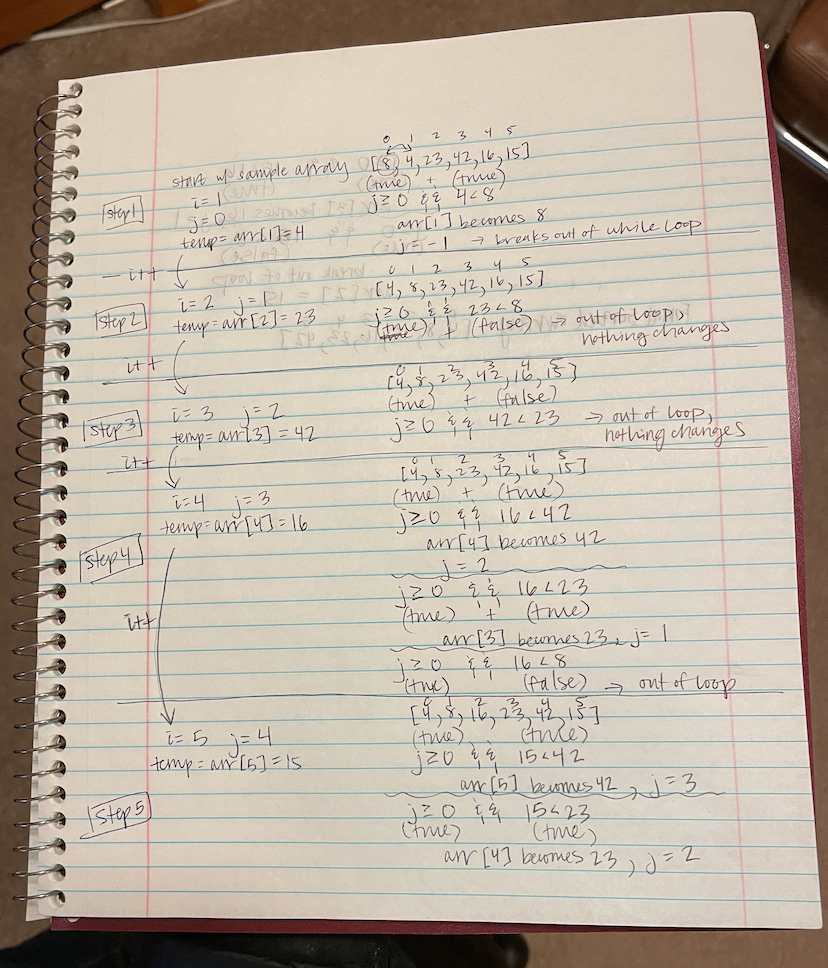
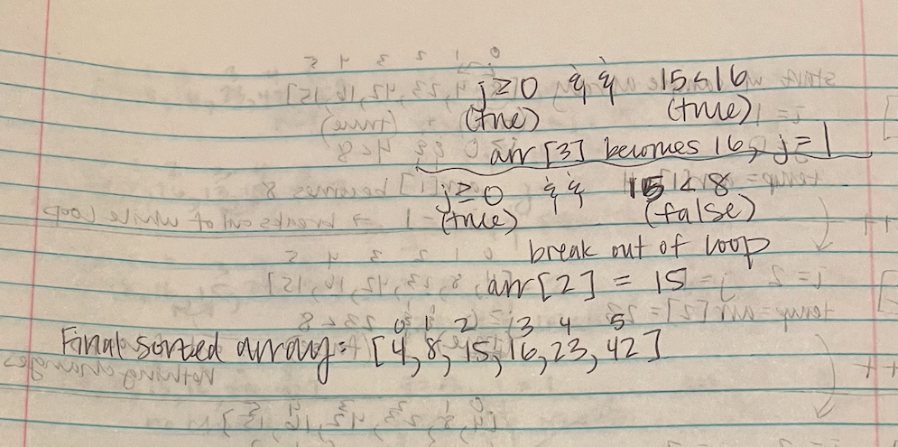

# Insertion Sort

Review the provided pseudocode, then trace the algorithm by stepping through the process with the provided sample array. Document your explanation by creating a blog article that shows the step-by-step output after each iteration through some sort of visual.

## Challenge

<!-- Description of the challenge -->
- Write a blog post stepping through the insertion sort algorithm
- Code a working, tested implementation of insertion sort based on the provided pseudocode

## Approach & Efficiency

<!-- What approach did you take? Why? What is the Big O space/time for this approach? -->
- Stepped through the algorithm step by step visually and then using the provided pseudocode to implement working code
- O(n^2) time / O(1) space

## Resources and Collaborators

## Whiteboard

