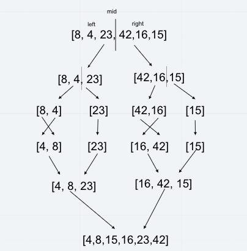

# Merge Sort

Merge sort is a sorting algorithm based off of the concept of divide and conquer to sort. It breaks down the array into smaller arrays, sorts them, and then merges everything back together.

## Steps

The sample array is [8,4,23,42,16,15].

Step 1: Split the array in half, based on the array.length/2.
Step 2: Continue dividing the subarrays until left with only single element arrays.
Step 3: Starting with the single element arrays, merge the sorted subarrays.
Step 4: Repeat until all merged into a single sorted array.

## Visual

## Code

Link to code [here](mergeSort.js)
