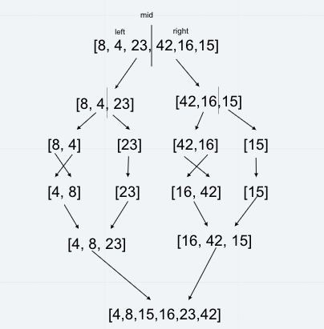

# Merge Sort

Review the provided pseudocode, then trace the algorithm by stepping through the process with the provided sample array. Document your explanation by creating a blog article that shows the step-by-step output after each iteration through some sort of visual.

## Challenge

<!-- Description of the challenge -->
- Provide a visual step through for each of the sample arrays based on the provided pseudo code
- Convert the pseudo-code into working code in JavaScript
- Present a complete set of working tests

## Approach & Efficiency

<!-- What approach did you take? Why? What is the Big O space/time for this approach? -->
- Stepped through the algorithm step by step visually and then using the provided pseudocode to implement working code
- O(n * log n) time / O(log n) space

## Resources and Collaborators

- Worked at lab table with Jason D, Jason D, Nick M, and Seid
- StackAbuse merge sort [article](https://stackabuse.com/merge-sort-in-javascript/)
- JavaScript plain english merge sort [article](https://javascript.plainenglish.io/javascript-merge-sort-3205891ac060)

## Whiteboard

